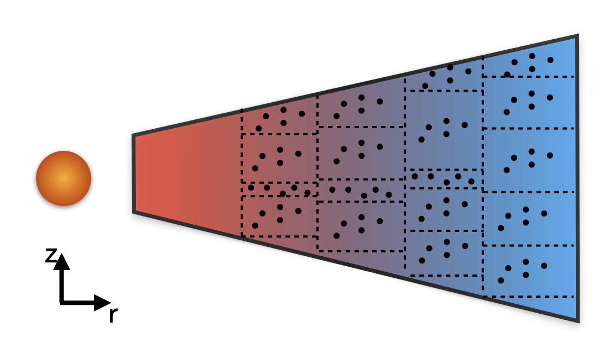

Dust coagulation
================

Dust coagulation in :code:`mcdust` is done with a Monte Carlo approach rather than solving the Smoluchowski equation. We briefly explain the method here.
For details we refer the reader to Drazkowksa et al 2013 and Zsom and Dullemond 2008. We follow representative particles and follow their evolution rather than tracking every single particle and its evolution. These :math:`n` representative particles statistically represent :math:`N` physical particles (:math:`n << N`).
For eg, the representative particle :math:`i` shares identical properties with :math:`N_i` physical particles. 
The total mass of physical particles in one swarm (:math:`M_{\mathrm{swarm}}`) is given by

.. math:: 

    M_{\mathrm{swarm}} = m_i N_i,

where :math:`m_i` is the mass of the representative particle :math:`i`. The fundamental assumption here is that :math:`M_{\mathrm{swarm}}` is the same for every swarm and is a constant that does not change with time. This means that if a particle grows (:math:`m_i` increases),
the number of particles it represents reduces (:math:`N_i` reduces). This is a statistical effect and not a physical effect.  

Collisions
++++++++++
In this framework, we assume that the representative particles themselves do not collide with each other (the collisions between the representative particles are too rare). The representative particles collide with physical (non-representative) particles whose history we do not track. We track only the representative particle and its evolution.

To perform a collision we choose a representative particle :math:`i` and a physical particle which represented by representative particle :math:`k`. The probability of a collision between particle :math:`i` and particle :math:`k` is given by

.. math:: 

    r_{ik} = \frac{N_k K_{ik}}{V},

where V is the cell volume and :math:`K_{ik}` is the coagulation kernel which is given by

.. math:: 

    K_{ik} = \Delta v_{ik} \sigma_{ik},

with :math:`\sigma_{ik}` being the geometric cross-section for the collision and :math:`\Delta v_{ik}` being the relative velocity between particle :math:`i` and :math:`k`. 

The total collision rate for any pair can be computed by

.. math:: 

    r = \sum_i \sum_k r_{ik}.

Then, we can choose the represenative particle. The probability that the chosen particle is :math:`i` is

.. math:: 

    P_i = \frac{\sum_k r_{ik}}{r}.

The probability that this particle collides with a non-representative particle :math:`k` is given by

.. math:: 

    P_{k|i} = \frac{r_{ik}}{\sum_k r_{ik}}.

Both these particles are chosen by drawing a random number.

The timestep between the collisions is determined as

.. math:: 

    \tau = - \frac{1}{r}\mathrm{ln}(\mathrm{rand}),

where rand is a random number drawn from a uniform distribution between 0 and 1.

The subroutines that compute the collision rates and probabilities can be found in :code:`collisions.f90`

And depending on the relative velocities the collisonal outcomes are decided for the particles. We explain the relative velocity formulation and the collisional outcomes below.

Relative velocities
-------------------
The sources for the velocities of the particles taken into account are: Brownian motion, turbulence, radial and azimuthal drift and differential settling.
This is similar to model followed by Birnstiel et al 2010. For the turbulent relative velocities, we use the prescription from Ormel and Cuzzi 2007.
The implementation of the relative velocities in :code:`mcdust` can be found in the :code:`relvels` subroutine in :code:`collisions.f90`

Collisional Outcomes
--------------------
In the standard model the collisional outcomes are sticking, fragmentation and erosion. The outcomes are decided based on the relative velocities of the particles.
If the relative velocities are below a threshold velocity then we perform sticking. This threshold is the fragmentation velocity :math:`v_{\mathrm{frag}}` which is an input parameter for :code:`mcdust`.
If the relative velocities are above the fragmentation velocity then there are two outcomes erosion and fragmentation depending on the mass ratio of the particles.
The implementation of collisions can be found in the subroutine :code:`collision` and subroutines therein, in the file :code:`collisions.f90`
Sticking
^^^^^^^^
In the case of sticking, we assume the physical particle :math:`k` has been completely merged into the representative particle :math:`i`.
As a result the mass of the particle :math:`i` becomes

.. math:: 

    m_i <= m_i + m_k.

Since the mass of the represenative particle :math:`i` increases, to conserve :math:`M_{\mathrm{swarm}}`, :math:`N_i` reduces.
This is a statistical effect and it can be balanced out with more collisions in the system. We refer the user to Zsom and Dullemond 2008 for a detailed discussion.

Fragmentation & Erosion
^^^^^^^^^^^^^^^^^^^^^^^
When the collision exceeds the fragmentation velocity it fragments. But there are two ways depending on the mass ratio between the particles. If two similar sized particles collide,
then this leads to a catastrophic fragmentation of both the particles which we term as fragmentation. But when a small particle collides with a larger particle, a catastrophic fragmentation is unlikely and
the likely event is that the small particle chips of a piece of the large particle. We term such an event as erosion. The threshold for the mass ratio between the particles can be set with the :code:`erosion_mass_ratio` parameter in the :code:`setup.par` file.
The default value is set to 10. We assume that in the case of erosion that mass excavated by the small particle is equal to the small particle. 

For both the cases, there are a distribution of fragments as a result and this distribution can be given by,

.. math:: 

    n(m)dm \propto m^\gamma dm,

where :math:`\gamma = - \frac{11}{6}` is a parameter arrived from collisional models such as Dohanyi 1969.

In the case of a full fragmentation, the largest mass of the fragment is the mass of the largest collider and in the case of erosion, the largest fragment has the mass of the smallest collider.

Collision Optimization
++++++++++++++++++++++
Zsom & Dullemond 2008 introduced a fine-tuning parameter, denoted as :math:`dm_{\rm{max}}`, into the algorithm to group collisions and thereby
accelerate computation. It limits the maximum mass ratio for grouping collisions, and the collision rate :math:`C_{i,j}` is altered as follows,
 

.. math:: 
 
    C^{\ast}_{i,j} = \frac{m{j}/m_{i}}{dm_{\rm{max}}}C_{i,j}

This approach is particularly advantageous in regions such as dust traps, where collisions between particles with a broad size distribution
occur frequently. Specifically, the probability of a collision between :math:`i`-th and :math:`j`-th can be reduced by a factor of, for example, 1000. When such a grouped collision occurs, 
particle :math:`i`-th is assumed to accrete the equivalent of 1000 times the mass of particle j. While computationally efficient, this 
simplification may not be realistic in dynamic systems, where particles can be advected across grid cells on timescales shorter than 
those required to undergo such a large number of collisions. To address this, we propose an adaptive :math:`dm_{\rm{max}}`, which depends not 
only on the mass ratio between colliding particles but also on the local collision rate and the spatial resolution of the grid.

The adaptive value of :math:`dm_{\rm{max}}` for a collision between the :math:`i`-th and :math:`j`-th particles is computed as follows:

.. math:: 

    \tau_{i, \rm{transport}} = \tau^{\ast}_{i,j, \rm{collision}}

.. math:: 
    \frac{\Delta r}{v_{r, i}} = \frac{1}{C^{\ast}_{i,j}}

.. math::

    \frac{\Delta r}{v_{r, i}} = \frac{dm_{\rm{max}}}{m_{j}/m_{i}}\frac{1}{C_{i,j}}

.. math:: 
    
    dm_{\rm{max}}=\frac{\Delta r}{v_{r, i}}\frac{m_{i}}{m_{j}}C_{i,j}

where :math:`\Delta r` is the radial width of the grid cell. Here, the transport velocity :math:`v_{r, i}` accounts for all advection mechanisms except turbulence, which is excluded due to its stochastic nature.
Hence, when the collision rate is high, :math:`dm_{\rm{max}}` can assume larger values, whereas in regions where transport is significant, :math:`m_{\rm{max}}` is reduced accordingly.
Additionally, since transport in our simulations can occur in the vertical direction as well, we generalize our expression as follows:

.. math:: 

    dm_{\rm{max}}=min(\frac{\Delta r}{v_{r, i}}, \frac{\Delta z}{v_{z, i}}) \cdot \frac{m_{i}}{m_{j}}C_{i,j}

Moreover, we constrain :math:`dm_{\rm{max}}` such that it does not introduce an error exceeding 1%. Consequently, :math:`dm_{\rm{max}}` is limited to a maximum value of 0.01. 

Adaptive Grid
+++++++++++++
Collisions happen between particles that are close proximity within each other and in order to resolve the physics properly in both high density and low density regions, we use an adaptive grid method to bin the partciles.
The method works in such a way that each cell has the same number of particles which can be set by the parameter :code:`number_of_particles_per_cell` in the :code:`setup.par` file. 

We show a schematic reprentation of the adaptive grid method below,

